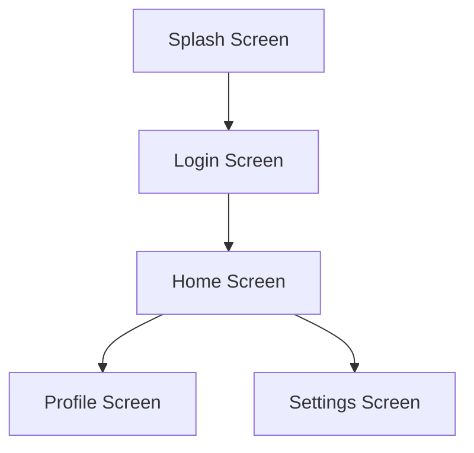

# Flutter Documentation Guidelines

## General Principles

- **Language**: All documentation, comments, and project documentation must be written in English.
- **Audience**: Write documentation for developers who will use or maintain the code.
- **Clarity**: Keep descriptions short, precise, and to the point.

## Code Documentation (DartDoc)

- **Use DartDoc comments**: Always use `///` (triple slashes) for documentation comments. Avoid using regular comments `//` or block comments `/* ... */` for API documentation.
- **Document Public APIs**: Every public class, property, method, and top-level function must have a documentation comment.
- **Summary Sentence**: The first sentence of a doc comment should be a concise, single-sentence summary of the member's purpose, ending with a period. It will be used in summary lists.
- **Third-Person Verbs**: Start function or method comments with third-person verbs (e.g., "Returns the...", "Initializes the...", "Calculates...").
- **Parameters and Returns**: Explain parameters and return values naturally in the prose. Use square brackets to reference code symbols (e.g., `[BuildContext]`, `[myParameter]`). Do NOT use JavaDoc style tags like `@param` or `@return`.

## Code Examples

- **Provide Context**: For complex widgets, state management logic, or utility functions, provide a usage example.
- **Markdown Blocks**: Use standard Markdown code blocks within DartDoc comments.

```dart
/// Calculates the total price with a given [taxRate].
///
/// Example:
/// ```dart
/// final total = calculateTotal(100.0, 0.2);
/// print(total); // 120.0
/// ```
double calculateTotal(double basePrice, double taxRate) {
  // ...
}
```

## Project-Level Documentation

- **README.md**: The root of the repository and any standalone packages should have a `README.md` containing:
  - Project/Package description.
  - Getting started / Setup instructions.
  - Basic usage examples.
- **CHANGELOG.md**: Keep a changelog following standard formats to track versions, features, and breaking changes.
- **Architecture Documentation**: Document high-level architectural decisions, state management flows (e.g., BLoC diagrams), and module interactions in a separate `docs/` folder using Markdown and Mermaid diagrams.

## UI & Navigation Documentation

For Flutter projects, it is mandatory to maintain a clear overview of the app's user interface and navigation flow. This should be documented in a dedicated file (e.g., `docs/ui_navigation.md`) or as part of the architecture documentation.

- **Screens List**: Maintain a comprehensive list of all screens (full-screen widgets, typically routes/pages) in the application.
- **Screen-to-Widget Mapping**: Every screen description MUST enumerate all the custom or significant widgets it contains.
- **Widget-to-Screen Mapping**: Maintain a list of reusable custom widgets. For each widget, document the list of screens where it is utilized.
- **Widget Relationships**: Describe the hierarchy and relationships between complex widgets (e.g., how a parent widget manages its children).
- **Navigation Flow Diagram**: Provide a visual diagram (using Mermaid) illustrating the navigation paths between screens (which screen leads to which).

Example of a Mermaid Navigation Flow Diagram:


## Maintenance and Code Review

- **Update with Code**: Documentation is a living entity. You must update documentation in the same commit where the relevant code changes.
- **Review Requirement**: Reviewers must check documentation accuracy and formatting as part of the standard PR review process.
