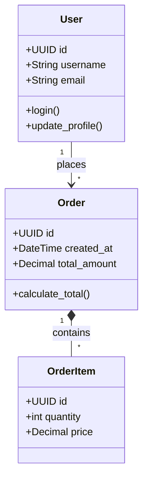

# Python Documentation Guidelines

## General Principles

- **Language**: All documentation, comments, and project documentation must be written in English.
- **Audience**: Write documentation for developers who will use or maintain the code.
- **Clarity**: Keep descriptions short, precise, and to the point.

## Code Documentation and Comments

- **Self-Documenting Code**: Code must be clear, readable, and self-documenting. Use descriptive variable, function, and class names so that the code's intent is obvious without requiring additional explanation.
- **No Redundant Comments**: Avoid using comments or docstrings to explain what the code does. The code should be clear enough that it doesn't need comments. If the code is too complex to understand without comments, refactor it to be simpler and more readable.
- **Exceptions for Comments**: Comments should ONLY be used to explain the "why" behind complex business logic, non-obvious workarounds, or external constraints that cannot be expressed through code alone.

## Type Hinting

- **Mandatory Typing**: Always use type hints ([PEP 484](https://peps.python.org/pep-0484/)) for all function signatures (arguments and return types) and class attributes.
- **Clarity**: Type hints complement the self-documenting nature of the code by providing static analysis benefits.

## Code Examples

- **Test Files**: For utility functions and complex logic, include examples in the test files rather than in docstrings.
- **Markdown Blocks**: For larger examples, use standard Markdown code blocks within external documentation.

## Project-Level Documentation

- **README.md**: The root of the repository should have a `README.md` containing:
  - Project description.
  - Setup instructions (e.g., `poetry install` or `pip install -r requirements.txt`).
  - Basic usage examples or CLI commands.
- **CHANGELOG.md**: Keep a changelog tracking versions, features, and breaking changes.
- **Architecture & API**: Document high-level architectural decisions, API contracts, and component interactions in a separate `docs/` folder using Markdown and Mermaid diagrams. For larger projects, consider using **MkDocs** or **Sphinx**.

## Architecture & Domain Documentation

For Python projects, particularly those dealing with complex business logic or data structures, it is mandatory to maintain a clear overview of the domain model and architectural components. This should be documented in a dedicated file (e.g., `docs/architecture.md`).

- **Class/Model List**: Maintain a comprehensive list of all significant classes, data models (e.g., Pydantic models, SQLAlchemy models, Dataclasses), and services in the application.
- **Component Description**: Every class/model description MUST concisely state its responsibility within the domain.
- **Class Relationships**: Describe the hierarchy, composition, and relationships between classes (e.g., Inheritance, One-to-Many relationships, Aggregations).
- **Module Interactions**: Document how different modules or services interact with each other (e.g., which service calls which repository).
- **Architecture Diagrams**: Provide visual diagrams (using Mermaid) illustrating the relationships between classes and the flow of data.

Example of a Mermaid Class Diagram:

## Maintenance and Code Review

- **Update with Code**: Documentation is a living entity. You must update type hints and markdown files in the same commit where the relevant code changes.
- **Review Requirement**: Reviewers must check documentation accuracy and type hints as part of the standard PR review process.
