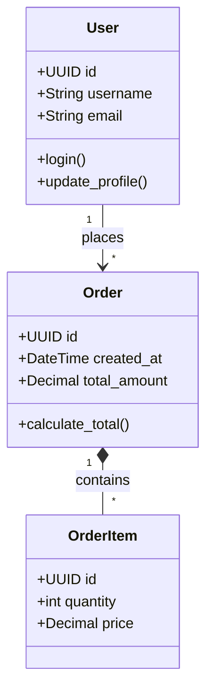

# Python Documentation Guidelines

## General Principles

- **Language**: All documentation, comments, and project documentation must be written in English.
- **Audience**: Write documentation for developers who will use or maintain the code.
- **Clarity**: Keep descriptions short, precise, and to the point.

## Code Documentation (Docstrings)

- **Use Docstrings**: Always use `"""` (triple double quotes) for docstrings, following [PEP 257](https://peps.python.org/pep-0257/).
- **Document Public APIs**: Every public module, class, method, and function must have a docstring.
- **Style Standard**: Use a consistent docstring format throughout the project. The **Google style** is recommended for readability.
- **Summary Line**: The first line of a docstring should be a concise, single-sentence summary of the object's purpose, ending with a period. It should be written in the imperative mood (e.g., "Return the...", "Calculate...", not "Returns" or "Calculates").
- **Parameters and Returns**: Clearly describe all arguments, keyword arguments, return values, and exceptions raised.

### Example (Google Style)

```python
def fetch_data(url: str, timeout: int = 10) -> dict:
    """Fetch data from the given URL and parse it as JSON.

    Args:
        url (str): The endpoint URL to fetch data from.
        timeout (int, optional): The maximum time in seconds to wait for a response. Defaults to 10.

    Returns:
        dict: A dictionary containing the parsed JSON data.

    Raises:
        ConnectionError: If the server cannot be reached.
        ValueError: If the response is not valid JSON.
    """
    pass
```

## Type Hinting

- **Mandatory Typing**: Always use type hints ([PEP 484](https://peps.python.org/pep-0484/)) for all function signatures (arguments and return types) and class attributes.
- **Clarity**: Type hints complement docstrings by providing static analysis benefits and making the code self-documenting.

## Code Examples

- **Doctests**: For utility functions and complex logic, include examples in the docstring using the interactive Python console format (`>>>`). This allows testing the examples using `doctest`.
- **Markdown Blocks**: For larger examples, use standard Markdown code blocks within docstrings or external documentation.

## Project-Level Documentation

- **README.md**: The root of the repository should have a `README.md` containing:
  - Project description.
  - Setup instructions (e.g., `poetry install` or `pip install -r requirements.txt`).
  - Basic usage examples or CLI commands.
- **CHANGELOG.md**: Keep a changelog tracking versions, features, and breaking changes.
- **Architecture & API**: Document high-level architectural decisions, API contracts, and component interactions in a separate `docs/` folder using Markdown and Mermaid diagrams. For larger projects, consider using **MkDocs** or **Sphinx**.

## Architecture & Domain Documentation

For Python projects, particularly those dealing with complex business logic or data structures, it is mandatory to maintain a clear overview of the domain model and architectural components. This should be documented in a dedicated file (e.g., `docs/architecture.md`).

- **Class/Model List**: Maintain a comprehensive list of all significant classes, data models (e.g., Pydantic models, SQLAlchemy models, Dataclasses), and services in the application.
- **Component Description**: Every class/model description MUST concisely state its responsibility within the domain.
- **Class Relationships**: Describe the hierarchy, composition, and relationships between classes (e.g., Inheritance, One-to-Many relationships, Aggregations).
- **Module Interactions**: Document how different modules or services interact with each other (e.g., which service calls which repository).
- **Architecture Diagrams**: Provide visual diagrams (using Mermaid) illustrating the relationships between classes and the flow of data.

Example of a Mermaid Class Diagram:


## Maintenance and Code Review

- **Update with Code**: Documentation is a living entity. You must update docstrings, type hints, and markdown files in the same commit where the relevant code changes.
- **Review Requirement**: Reviewers must check documentation accuracy, docstring formats, and type hints as part of the standard PR review process.
